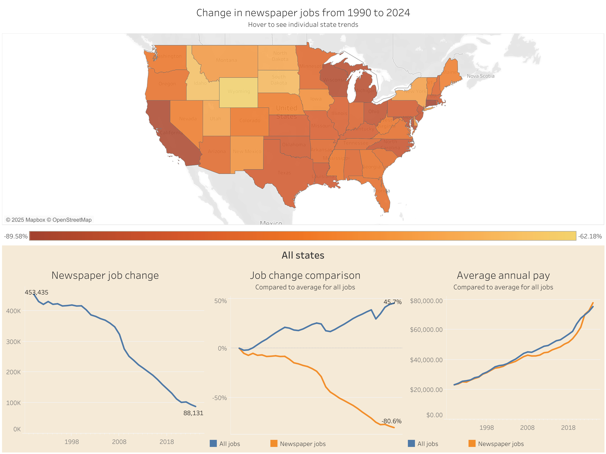
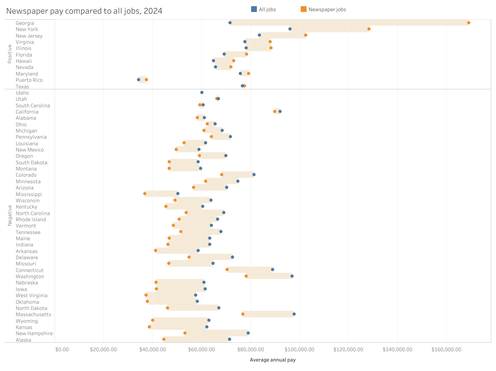

# Statewide job trends from QCEW
This repository includes a `dlt` pipeline, `dbt` transformations and two visualizations built in a Tableau workbook and Tableau Public dashboard, showing based on data from the [U.S. Bureau of Labor Statistic's Quarterly Census of Employment and Wages](https://www.bls.gov/cew/overview.htm). The specific output of this project is a Tableau Public workbook that summarizes trends specifically about newpaper publishing jobs from 1990 through the latest available year, a subject [I've reported on before](https://themainemonitor.org/the-growing-crisis-in-the-maine-newspaper-industry/), with an eye toward Maine. 

This pipeline demonstrates a useful stack for Tableau Public projects that follows data engineering and transformation best practices, using `dlt`, `dbt` and `duckdb` to prepare and document data for consumption locally in Tableau Public. This structure could easily co-exist with other analysis or workflows, given the ease in `dlt` of running pipelines to other database targets.

This project also includes the full statewide database of QCEW data which can be explored directly in read-only mode using [DuckDB over HTTPS](https://duckdb.org/docs/stable/guides/network_cloud_storage/duckdb_over_https_or_s3.html).

## Visualizations
Analyzing newspaper jobs is one narrow application of QCEW data, but demonstrates some restrictions and considerations specific to the QCEW data by industry. For one, NAICS codes evolve over time and newspaper publishing specifically moved in the 2021 NAICS categories, which is reflected in the associated dbt model.

### State trends
The visualization below shows the change in payroll newspaper publishing jobs from 1990 through 2024. Certainly, this captures more than just newsroom jobs, but it reflects a serious decline, especially as the data includes online-only publications as well.

The visualizations below allow exploration by state to see how newspaper publishing job trends compare with that of all jobs during the period, in raw job counts and in percent change over time.

### Pay trends for latest year
Generally, pay has not kept with all jobs, but there are a few outlier markets that we might be able to guess where newspaper publishing pay is higher than the average job. Those include: New York, New Jersey, and Virginia. For 2014, Georgia leads the pack, which I suspect is the result of a consolidation of news executives.

The trends highlight some of the trouble with the discourse about "media elites." One can see quite clearly that this inversion of pay relative to all jobs for newspaper publishing does not reflect that narrative in most areas of the country.

## Data pipeline
The pipeline is built in `dlt` and sources data from [ZIP archives](https://www.bls.gov/cew/downloadable-data-files.htm) maintained by the U.S. Bureau of Labor Statistics. The pipeline processes only statewide data but could easily be adapted to load all or different geographies. 

## Transformations
The `dbt` project here is mostly demonstrative, as there is just one view that is prepared for consumption downstream in Tableau. This view lives within a `tableau_public` schema that, by default, writes any view output to a folder `tableau_public` as a CSV within the repository. This configuration is found within [`dbt_project.yml`](newspaper_jobs/dbt_project.yml), using the +post-hook attribute for models within the `tableau_public` schema.

This pattern could be generally useful within a `dbt` project that includes more involved data cleaning and transformations, allowing for extraction at different levels of granularity or with obfuscation for use in Tableau Public. Primarily, this ensures there are no problems publishing to Tableau Public based on the database connection type. Workbooks sourced directly from DuckDB, for example, are not publishable to Tableau Public. 

## Reproducing repository
1. Clone the repository with git.
2. Navigate to the project directory and run `make` to see options.
3. Use `make pipeline` to run extract, transform and test steps, which will run the dlt pipeline and dbt transformations in sequence.

The Tableau Workbook is [included in this repository](statewide_newspaper_job_trends.twbx) and available in links above from Tableau Public directly. 